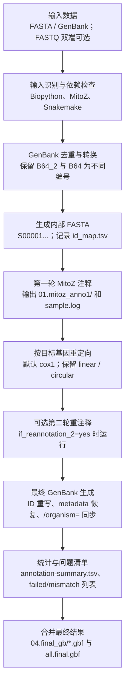
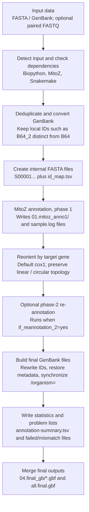

# batch_mitoz.py 使用说明 / User Guide

本文档说明 `batch_mitoz.py` 的用途、输入格式、各子命令、常用参数、输出文件和工作流程。
This document explains the purpose, inputs, subcommands, key options, outputs, and workflow of `batch_mitoz.py`.

## 脚本定位 / What The Script Does

`batch_mitoz.py` 是一个 MitoZ 批量线粒体注释和 GenBank 后处理管线。

`batch_mitoz.py` is a batch MitoZ annotation and GenBank post-processing pipeline for mitochondrial sequences.

它主要完成：

- 识别 FASTA 或 GenBank 输入。
- 把 GenBank 输入去重并转换为内部 FASTA。
- 为每条记录生成短内部 ID，例如 `S00001`，避免 MitoZ 或 GenBank LOCUS 名称过长。
- 批量调用 MitoZ 注释。
- 按目标基因重定向序列，默认 `cox1`。
- 可选对重定向后的序列做第二轮 MitoZ 注释。
- 把原始 GenBank header metadata 转移回最终结果。
- 修复 MitoZ 输出中 `FEATURES source` 的 `/organism=`。
- 输出最终 `.gbf`、统计表、日志、失败列表和合并文件。

It can:

- Detect FASTA or GenBank input.
- Deduplicate GenBank records and convert them to internal FASTA.
- Generate short internal IDs such as `S00001`.
- Run MitoZ annotation in batch.
- Reorient records by a target gene, defaulting to `cox1`.
- Optionally run a second MitoZ annotation pass after reorientation.
- Restore original GenBank header metadata.
- Restore `/organism=` inside `FEATURES source`.
- Write final `.gbf` files, summary tables, logs, failure lists, and merged GenBank archives.

## 依赖 / Requirements

基础依赖：

- Python 3.8+
- Biopython
- MitoZ，真实运行 `annotate` 或 `run` 必需
- Snakemake，可选，用于调度多任务
- Conda，可选，用于 `--conda_env_mitoz`

Basic requirements:

- Python 3.8+
- Biopython
- MitoZ, required for real `annotate` or `run` jobs
- Snakemake, optional scheduler
- Conda, optional when using `--conda_env_mitoz`

检查帮助：

```bash
python3 batch_mitoz.py --help
python3 batch_mitoz.py run --help
python3 batch_mitoz.py annotate --help
python3 batch_mitoz.py reorient --help
python3 batch_mitoz.py transfer_metadata --help
python3 batch_mitoz.py replace_organism --help
```

## 输入格式 / Input Formats

### FASTA 输入 / FASTA Input

支持扩展名：

```text
.fa .fasta .fna .fas
```

FASTA header 中可以包含 topology：

```text
>B9  topology=linear
ATGC...
```

如果没有写 `topology=linear` 或 `topology=circular`，脚本默认按 `circular` 处理。

Supported FASTA extensions are `.fa`, `.fasta`, `.fna`, and `.fas`. If no topology tag is present, the script assumes `circular`.

### GenBank 输入 / GenBank Input

支持扩展名：

```text
.gb .gbk .genbank .gbf
```

GenBank 输入会先执行：

1. 解析所有 record。
2. 跳过无序列 record，但保留其 metadata 来源索引。
3. 去除完全重复、版本重复或序列重复的 record。
4. 转换为内部 FASTA 后再进入 MitoZ。

GenBank input is parsed, deduplicated, converted to internal FASTA, and then passed to MitoZ.

注意：当前版本已避免把本地样本名 `B64_2` 误认为 accession version，因此 `B64` 和 `B64_2` 会保持为不同样本。

Note: local IDs such as `B64_2` are kept distinct from `B64`.

### 目录扫描与多序列 FASTA / Directory Scanning And Multi-record FASTA

输入目录会递归扫描。若同一目录同时包含 FASTA 和 GenBank，`annotate` / `run` 会优先使用 GenBank 文件，并忽略该目录中的 FASTA 文件。

Input directories are scanned recursively. If a directory contains both FASTA and GenBank files, `annotate` / `run` use the GenBank files and ignore the FASTA files in that mixed directory.

多记录 FASTA 默认会按 record 拆分：

```bash
--if_split_fasta yes
```

如果设置：

```bash
--if_split_fasta no
```

但输入 FASTA 含多个 record，脚本会报错退出。

By default, multi-record FASTA files are split into individual records. With `--if_split_fasta no`, a multi-record FASTA causes the script to exit with an error.

### FASTQ 输入 / Optional FASTQ Input

FASTQ 仅用于 `annotate` / `run`，并且只在同时找到 `fq1` 和 `fq2` 时传给 MitoZ。脚本按最终 `sample_name` 查找双端 FASTQ。

FASTQ options are only used by `annotate` / `run`. Files are passed to MitoZ only when both `fq1` and `fq2` are found. Matching is based on the final `sample_name`.

如果 MitoZ 需要 paired FASTQ，可使用：

```bash
--infq /path/to/fastq_dir
--fq_position flat
--suffix_fq _1.clean.fq.gz,_2.clean.fq.gz
```

`--fq_position flat` 表示 FASTQ 文件直接在 `--infq` 目录下：

```text
<sample_name>_1.clean.fq.gz
<sample_name>_2.clean.fq.gz
```

`--fq_position sample_dir` 表示每个样本有单独子目录：

```text
fastq_dir/<sample_name>/<sample_name>_1.clean.fq.gz
fastq_dir/<sample_name>/<sample_name>_2.clean.fq.gz
```

在 `sample_dir` 模式下，脚本会优先找精确文件名；如果没有精确文件名，会取该样本子目录中第一个匹配 `*suffix1` 和 `*suffix2` 的文件。`--suffix_fq` 必须是两个逗号分隔的后缀。

In `sample_dir` mode, exact filenames are preferred. If exact names are absent, the first files matching `*suffix1` and `*suffix2` in the sample subdirectory are used. `--suffix_fq` must contain exactly two comma-separated suffixes.

## 子命令总览 / Subcommands

| 子命令 | 用途 | English |
|---|---|---|
| `run` | 完整流程：注释、重定向、可选二轮注释、最终 GenBank 生成 | Full pipeline |
| `annotate` | 只做批量 MitoZ 注释和最终整理 | Annotation only |
| `reorient` | 只对已有 GenBank 按目标基因重定向 | Reorient existing GenBank |
| `transfer_metadata` | 单独转移 GenBank header metadata | Standalone metadata transfer |
| `replace_organism` | 单独修复 `/organism=` 和 SOURCE | Standalone organism/source restoration |

## 推荐主流程：run / Recommended Main Workflow

`run` 是最完整、最推荐的子命令。

`run` is the recommended full pipeline.

典型流程：

```text
输入 FASTA / GenBank
→ 内部 FASTA 和 id_map.tsv
→ 第一轮 MitoZ 注释
→ 按 cox1 或指定基因重定向
→ 可选第二轮 MitoZ 注释
→ 最终 ID 重写
→ metadata 恢复
→ /organism= 同步
→ 统计和合并输出
```

### 用 Conda 环境运行 / Run With A Conda MitoZ Environment

```bash
python3 batch_mitoz.py run \
  -i /path/to/input_fasta_or_genbank \
  -o mitoz_run_out \
  --conda_env_mitoz mitoz3.6 \
  --scheduler_backend threads \
  --threads 8 \
  --max_tasks 4 \
  --clade Arthropoda \
  --genetic_code 5 \
  --which_gene_first cox1 \
  --if_reannotation_2 yes \
  --preserve_phase1_metadata yes
```

### 用指定 MitoZ 路径运行 / Run With A MitoZ Executable Path

```bash
python3 batch_mitoz.py run \
  -i /path/to/input_fasta_or_genbank \
  -o mitoz_run_out \
  --mitoz_path /path/to/mitoz \
  --scheduler_backend threads \
  --threads 8 \
  --max_tasks 4 \
  --clade Arthropoda \
  --genetic_code 5
```

`--mitoz_path` 可以是 MitoZ 可执行文件，也可以是包含 `mitoz` 的目录。

`--mitoz_path` can point to the MitoZ executable or to a directory containing it.

### 当前目录 FASTA 示例 / Example For The Current Directory

当前目录已有：

```text
summary_all.fasta
rename_summary_all.fasta
```

如果要用已改名后的 FASTA 跑完整流程，可用：

```bash
python3 batch_mitoz.py run \
  -i rename_summary_all.fasta \
  -o mitoz_run_renamed_out \
  --conda_env_mitoz mitoz3.6 \
  --scheduler_backend threads \
  --threads 8 \
  --max_tasks 4 \
  --clade Arthropoda \
  --genetic_code 5 \
  --which_gene_first cox1
```

请把 `mitoz3.6`、`Arthropoda`、`genetic_code` 改成你真实数据需要的值。

Replace `mitoz3.6`, `Arthropoda`, and `genetic_code` with values appropriate for your dataset.

### 带 FASTQ 的 run 示例 / run With Optional FASTQ

```bash
python3 batch_mitoz.py run \
  -i input.fasta \
  -o mitoz_run_out \
  --conda_env_mitoz mitoz3.6 \
  --infq /path/to/fastq_dir \
  --fq_position sample_dir \
  --suffix_fq _1.clean.fq.gz,_2.clean.fq.gz \
  --scheduler_backend threads \
  --threads 8 \
  --max_tasks 4 \
  --clade Arthropoda \
  --genetic_code 5
```

### Snakemake 调度示例 / Snakemake Scheduler Example

```bash
python3 batch_mitoz.py run \
  -i input.fasta \
  -o mitoz_run_out \
  --conda_env_mitoz mitoz3.6 \
  --scheduler_backend snakemake \
  --snakemake_bin /path/to/snakemake \
  --smk_cores 64 \
  --smk_mem_mb 256000 \
  --smk_latency_wait 60 \
  --smk_extra '--profile slurm' \
  --threads 8 \
  --max_tasks 8 \
  --clade Arthropoda \
  --genetic_code 5
```

## 一轮注释：annotate / Annotation Only

`annotate` 只运行第一轮 MitoZ 注释，并把 MitoZ 结果整理为最终 `.gbf`。

`annotate` runs one MitoZ annotation pass and finalizes the `.gbf` output.

注意：`annotate` 不做第二轮注释，但最终 `.gbf` 写出前仍会执行 ID 重写，并按 `--which_gene_first` 做一次保证性重定向；默认目标基因为 `cox1`，负链目标基因默认会反向互补。`--preserve_phase1_metadata` 在 `annotate` 中默认是 `no`，只有 GenBank 输入且显式设为 `yes` 时才恢复原始 header metadata。

Note: `annotate` does not run phase-2 annotation, but final `.gbf` files are still ID-rewritten and reoriented by `--which_gene_first`. Metadata preservation defaults to `no` for `annotate`.

```bash
python3 batch_mitoz.py annotate \
  -i /path/to/fasta_or_genbank \
  -o annotate_out \
  --conda_env_mitoz mitoz3.6 \
  --scheduler_backend threads \
  --threads 8 \
  --max_tasks 4 \
  --clade Arthropoda \
  --genetic_code 5
```

适合：

- 不需要第二轮注释。
- 只想批量运行 MitoZ 并标准化输出文件名。

Use it when one annotation pass is enough.

追加 MitoZ 参数示例：

```bash
python3 batch_mitoz.py annotate \
  -i input.fasta \
  -o annotate_out \
  --conda_env_mitoz mitoz3.6 \
  --mitoz_extra '--your-extra-mitoz-flag value'
```

## 只重定向：reorient / Reorient Only

`reorient` 不运行 MitoZ，只处理已有 GenBank 文件。

`reorient` does not run MitoZ. It only reorients existing GenBank files.

`reorient` 的 `-i` 必须是 GenBank 文件或 GenBank 目录；FASTA 输入不会被该 workflow 处理。由于该子命令复用了通用参数，帮助中会显示 `--if_split_fasta` 和 `--id_maxlen`，但它们对 `reorient` 无实际作用。

For `reorient`, `-i` must be a GenBank file or directory. FASTA input is not processed by this workflow. `--if_split_fasta` and `--id_maxlen` appear in the shared help output but have no practical effect for `reorient`.

```bash
python3 batch_mitoz.py reorient \
  -i /path/to/genbank_dir \
  -o reorient_out \
  --which_gene_first cox1
```

如果目标基因在负链上，默认会反向互补，使目标基因转到正向。如果不想这样做：

```bash
python3 batch_mitoz.py reorient \
  -i /path/to/genbank_dir \
  -o reorient_out \
  --which_gene_first cox1 \
  --no_force_forward
```

By default, minus-strand target genes are reverse-complemented. Use `--no_force_forward` to disable that behavior.

## 单独转移 metadata / Standalone Metadata Transfer

`transfer_metadata` 用原始 GenBank 的 header 区域替换重新注释 GenBank 的 header 区域，保留新文件的 `FEATURES` 和 `ORIGIN` 主体。

`transfer_metadata` replaces the header section of re-annotated GenBank files with metadata from the original GenBank files while keeping the new `FEATURES` and `ORIGIN`.

```bash
python3 batch_mitoz.py transfer_metadata \
  -m /path/to/original_gb_dir \
  -n /path/to/new_body_gb_dir \
  -o transfer_metadata_out \
  --smart_metadata no
```

单文件模式可指定输出文件名：

```bash
python3 batch_mitoz.py transfer_metadata \
  -m original.gbf \
  -n reannotated.gbf \
  -o transfer_metadata_out \
  --output_name final_with_metadata.gbf
```

如果需要自动接受模糊匹配：

```bash
python3 batch_mitoz.py transfer_metadata \
  -m original.gbf \
  -n reannotated.gbf \
  -o transfer_metadata_out \
  --smart_metadata yes \
  --auto_accept_metadata yes
```

注意：目录模式下如果 metadata 目录中存在多个相同 stem 的文件，脚本会报错退出，避免错配 header。

In directory mode, duplicate metadata stems are rejected to avoid header mismatches.

输出与行为：

- 输出目录默认是 `transfer_metadata_out/`。
- 新文件默认写入 `transfer_metadata_out/transferred_gb/`。
- 审计表是 `transfer_metadata.tsv`。
- 日志是 `transfer_metadata.log`。
- 目录模式按文件 stem 配对 `metadata` 与 `new_body`；metadata 目录中重复 stem 会报错退出。
- `--output_name` 仅单文件模式有效。
- `--overwrite_new_body yes` 会直接覆盖 `-n/--new_body` 指定的 body 文件。
- `--if_replace_metadata no` 时不替换 header，只复制或保留 new body。

Outputs and behavior:

- Default output root: `transfer_metadata_out/`.
- New files are written to `transfer_metadata_out/transferred_gb/` by default.
- Audit table: `transfer_metadata.tsv`.
- Log file: `transfer_metadata.log`.
- Directory mode pairs metadata and body files by stem; duplicate metadata stems are rejected.
- `--output_name` is valid only in single-file mode.
- `--overwrite_new_body yes` overwrites the files supplied by `-n/--new_body`.
- `--if_replace_metadata no` keeps or copies the new body without replacing the header.

## 单独修复 organism / Standalone Organism Replacement

`replace_organism` 修复 `FEATURES source` 中的 `/organism=`，也可以同步 SOURCE 文本。

`replace_organism` restores `/organism=` inside `FEATURES source` and can also sync the SOURCE text.

```bash
python3 batch_mitoz.py replace_organism \
  -m /path/to/original_gb_dir \
  -n /path/to/new_body_gb_dir \
  -o replace_organism_out
```

如需覆盖输入文件：

```bash
python3 batch_mitoz.py replace_organism \
  -m /path/to/original_gb_dir \
  -n /path/to/new_body_gb_dir \
  --overwrite_new_body yes
```

Use overwrite mode carefully because it modifies the input body files in place.

输出与匹配规则：

- 输出目录默认是 `replace_organism_out/`。
- 新文件默认写入 `replace_organism_out/replaced_organism/`。
- 审计表是 `replace_organism.tsv`，列为 `source_file`, `output_file`, `replaced`, `not_found`, `total`, `note`。
- 日志是 `replace_organism.log`。
- 匹配依据是 GenBank accession 及其兼容变体。
- 匹配成功时更新 SOURCE 文本和 source feature 的 `/organism=`。
- 未匹配 record 保持不变。

Outputs and matching:

- Default output root: `replace_organism_out/`.
- New files are written to `replace_organism_out/replaced_organism/` by default.
- Audit table: `replace_organism.tsv`.
- Log file: `replace_organism.log`.
- Matching uses GenBank accessions and compatible accession variants.
- On match, SOURCE text and source-feature `/organism=` are updated.
- Unmatched records are left unchanged.

## 关键参数 / Key Options

| 参数 | 适用子命令 | 中文说明 | English |
|---|---|---|---|
| `-i`, `--input` | `run`, `annotate`, `reorient` | FASTA 或 GenBank 文件/目录；`reorient` 只处理 GenBank | Input FASTA or GenBank; `reorient` accepts GenBank only |
| `-o`, `--out_root` | all | 输出根目录；`run`/`annotate`/`reorient` 默认 `mitoz_batch_out`，其他子命令各有默认值 | Output root; defaults vary by subcommand |
| `--which_gene_first` | `run`, `annotate`, `reorient` | 重定向起始基因，默认 `cox1` | Target gene for reorientation, default `cox1` |
| `--force_forward` / `--no_force_forward` | `run`, `annotate`, `reorient` | 目标基因在负链时是否反向互补，默认开启 | Reverse-complement minus-strand target genes by default |
| `--if_split_fasta` | `run`, `annotate` | 多序列 FASTA 是否拆分，默认 `yes`；对 `reorient` 无实际作用 | Split multi-record FASTA, default `yes`; no practical effect for `reorient` |
| `--id_maxlen` | `run`, `annotate` | 内部 ID 最大长度，必须至少 6；对 `reorient` 无实际作用 | Maximum internal ID length, minimum 6; no practical effect for `reorient` |
| `--conda_exe` | `run`, `annotate` | Conda 可执行文件名，默认 `conda` | Conda executable, default `conda` |
| `--conda_env_mitoz` | `run`, `annotate` | 含 MitoZ 的 Conda 环境名 | Conda environment containing MitoZ |
| `--mitoz_path` | `run`, `annotate` | MitoZ 可执行文件或目录 | Path to MitoZ executable or directory |
| `--threads` | `run`, `annotate` | 每个 MitoZ 任务线程数，必须为正整数 | Threads per MitoZ job, positive integer |
| `--max_tasks` | `run`, `annotate` | 同时运行的任务数，必须为正整数 | Maximum concurrent jobs, positive integer |
| `--clade` | `run`, `annotate` | MitoZ clade，必须按物种设置 | MitoZ clade, set for your taxa |
| `--genetic_code` | `run`, `annotate` | 遗传密码表，默认 5 | Genetic code, default 5 |
| `--species_name` | `run`, `annotate` | 传给 MitoZ annotate 的物种名 | Species name passed to MitoZ annotate |
| `--mitoz_extra ARG` | `run`, `annotate` | 追加传给 MitoZ annotate 的参数，可重复 | Extra MitoZ annotate arguments, repeatable |
| `--infq`, `--fq_position`, `--suffix_fq` | `run`, `annotate` | 可选双端 FASTQ；`--suffix_fq` 必须有两个逗号分隔后缀 | Optional paired FASTQ; suffix list must contain two comma-separated values |
| `--scheduler_backend` | `run`, `annotate` | `auto` / `threads` / `snakemake`，默认 `auto` | Scheduler backend, default `auto` |
| `--snakemake_bin`, `--smk_cores`, `--smk_mem_mb`, `--smk_latency_wait`, `--smk_extra` | `run`, `annotate` | Snakemake 后端参数；数值项必须为正整数 | Snakemake backend options; numeric values must be positive integers |
| `--if_reannotation_2` | `run` | 是否运行第二轮注释，默认 `yes` | Enable phase-2 re-annotation, default `yes` |
| `--preserve_phase1_metadata` | `run`, `annotate` | `run` 默认 `yes`；`annotate` 默认 `no` | Defaults to `yes` for `run`, `no` for `annotate` |
| `--smart_metadata` | `run`, `transfer_metadata` | 开启模糊 metadata 匹配 | Enable fuzzy metadata matching |
| `--auto_accept_metadata` | `run`, `transfer_metadata` | 自动接受最佳模糊匹配；必须配合 `--smart_metadata yes` | Auto-accept best fuzzy match; requires `--smart_metadata yes` |
| `-m`, `--metadata` | `transfer_metadata`, `replace_organism` | 原始 GenBank metadata 来源 | Original GenBank metadata source |
| `-n`, `--new_body` | `transfer_metadata`, `replace_organism` | 新 GenBank body 来源 | New GenBank body source |
| `--if_replace_metadata` | `transfer_metadata` | 是否替换 header metadata，默认 `yes` | Replace header metadata, default `yes` |
| `--overwrite_new_body` | `transfer_metadata`, `replace_organism` | 是否原地覆盖 `new_body` | Overwrite `new_body` in place |
| `--output_name` | `transfer_metadata` | 单文件模式输出文件名 | Output filename in single-file mode |

## 调度建议 / Scheduler Recommendations

### threads 后端 / threads Backend

本地机器推荐先用：

```bash
--scheduler_backend threads --threads 8 --max_tasks 4
```

实际总线程消耗约为：

```text
threads × max_tasks
```

例如 `8 × 4 = 32`。请不要超过机器可承受的 CPU 和内存。

The approximate CPU demand is `threads × max_tasks`.

### Snakemake 后端 / Snakemake Backend

```bash
--scheduler_backend snakemake \
--smk_cores 64 \
--smk_mem_mb 256000 \
--threads 8 \
--max_tasks 8
```

当前版本生成的 Snakefile 会把每个任务声明为真实 `threads`，并声明每任务内存资源，避免调度器误判。

The generated Snakefile declares real per-job `threads` and memory resources.

## 输出目录 / Output Layout

完整 `run` 输出通常包括：

```text
mitoz_run_out/
├── pipeline.log
├── run_params.json
├── 00.internal_fasta/
│   ├── S00001.fasta
│   └── id_map.tsv
├── 00.gb_converted_fasta/
│   └── dedup_report.tsv
├── 00.reoriented_fasta_internal/
├── 01.mitoz_anno1/
├── 03.mitoz_anno2_reoriented/
├── 04.final_gb/
│   ├── SAMPLE.gbf
│   └── no_{which_gene_first}_gene/
├── annotation-summary.tsv
├── metadata_transfer_log.tsv
├── all.final.gbf
├── annotation_failed.txt
├── final_write_failed.txt
├── reorient_failed.txt
├── metadata_transfer_failed.txt
├── metadata_key_mismatch.txt
└── all_problem_samples.txt
```

主要文件：

- `pipeline.log`: 总日志。
- `sample.log`: 每个样本的 MitoZ 运行日志。
- `id_map.tsv`: 内部 ID 与原始样本名映射。
- `dedup_report.tsv`: GenBank 输入去重报告。
- `annotation-summary.tsv`: 最终 PCG / tRNA / rRNA 统计。
- `metadata_transfer_log.tsv`: metadata 转移审计。
- `04.final_gb/*.gbf`: 最终 GenBank 文件。
- `all.final.gbf`: 合并后的最终 GenBank。
- `*_failed.txt`, `*_mismatch.txt`: 问题样本列表。

`annotation-summary.tsv` 中的 `cox1_orientation_ok` 是历史列名。当 `--which_gene_first` 不是 `cox1` 时，该列实际表示指定目标基因是否重定向成功。

The `cox1_orientation_ok` column name is historical. If `--which_gene_first` is not `cox1`, the column still means whether the selected target gene was successfully used for reorientation.

`annotate` 输出通常包括：

```text
annotate_out/
├── pipeline.log
├── run_params.json
├── 00.internal_fasta/
│   └── id_map.tsv
├── 00.gb_converted_fasta/
│   └── dedup_report.tsv
├── 01.mitoz_anno1/
├── 04.final_gb/
├── annotation-summary.tsv
├── all.final.gbf
├── annotation_failed.txt
└── final_write_failed.txt
```

列表和 TSV 在内容为空时可能不会生成。

Some report files are written only when non-empty.

## 注意事项 / Practical Notes

1. `--clade` 默认值是 `Annelida-segmented-worms`。非环节动物数据必须显式修改。
2. `--genetic_code` 默认是 5，即无脊椎动物线粒体密码表；请按物种确认。
3. `--id_maxlen` 不能小于 6，否则内部 ID 会冲突；脚本现在会拒绝这种参数。
4. 线性序列重定向后会保留 `linear` topology，不会被强制改成 `circular`。
5. 多 contig 样本中缺少目标基因的 contig 会合并回最终结果，不会静默丢弃。
6. 如果 MitoZ 不在 PATH 中，使用 `--conda_env_mitoz` 或 `--mitoz_path`。
7. 如果只需要改名 FASTA header，不需要运行本脚本；可以直接处理 FASTA 文本。

Notes:

1. The default `--clade` is `Annelida-segmented-worms`; change it for other taxa.
2. The default `--genetic_code` is 5; verify it for your dataset.
3. `--id_maxlen` must be at least 6.
4. Linear records keep linear topology after reorientation.
5. Partial no-target-gene contigs are merged back into final outputs.
6. Use `--conda_env_mitoz` or `--mitoz_path` if MitoZ is not in PATH.
7. Simple FASTA header renaming does not require this MitoZ pipeline.

## 流程图 / Flowcharts

已生成以下流程图文件：

- 中文 SVG: [docs/flowcharts/batch_mitoz_workflow.zh.svg](docs/flowcharts/batch_mitoz_workflow.zh.svg)
- English SVG: [docs/flowcharts/batch_mitoz_workflow.en.svg](docs/flowcharts/batch_mitoz_workflow.en.svg)
- 中文 Mermaid: [docs/flowcharts/batch_mitoz_workflow.zh.mmd](docs/flowcharts/batch_mitoz_workflow.zh.mmd)
- English Mermaid: [docs/flowcharts/batch_mitoz_workflow.en.mmd](docs/flowcharts/batch_mitoz_workflow.en.mmd)
- SVG 生成脚本: [scripts/render_workflow_diagrams.py](scripts/render_workflow_diagrams.py)

重新生成 SVG：

```bash
python3 scripts/render_workflow_diagrams.py
```

### 中文流程图 / Chinese Workflow



### English Workflow


